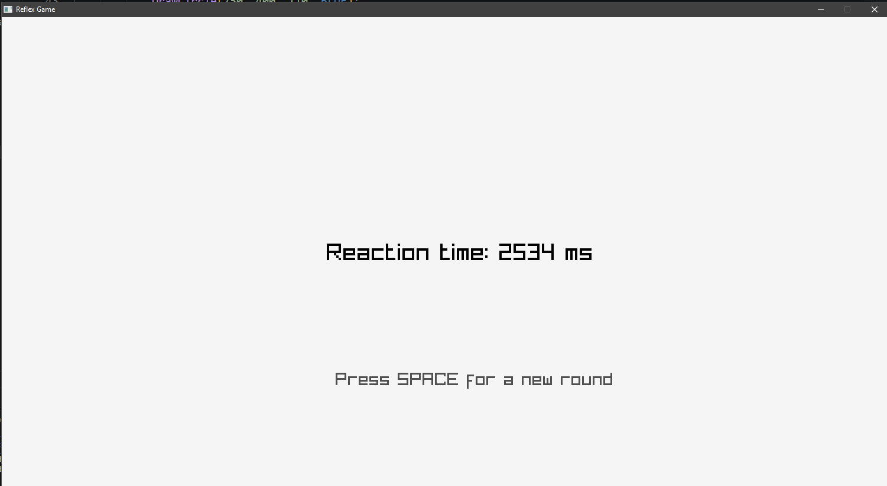

# Reflex Game

A reaction time test game built in C with [raylib](https://www.raylib.com/). Wait for the red circle, then press the UP arrow as fast as you can. The game measures your reaction time in milliseconds.



## About this project

I'm learning C from scratch, and this is one of my practice projects. I made it to practice game loops, state machines, timing and randomness with raylib. It's not professional code, just a learning project, so feedback and suggestions are welcome.

## How to play

1. Start the game. You'll see a **blue circle**.
2. Wait. After a random delay (2 to 5 seconds) the circle turns **red**.
3. Press the **UP arrow** as fast as you can.
4. Your reaction time is shown on the screen in milliseconds.
5. Press **SPACE** to play another round.

If you press UP while the circle is still blue, you get a "Too early!" message. Press SPACE to try again.

| Key | Action |
|---|---|
| UP arrow | React to the red circle |
| SPACE | Start a new round (after a result or a false start) |
| ESC / close window | Quit |

## Requirements

- Windows (this is the only platform I have tested it on)
- [MinGW-w64](https://www.mingw-w64.org/) (`gcc`)
- [raylib](https://github.com/raysan5/raylib/releases) (the `win64_mingw-w64` build)

## Installation

### 1. Install a C compiler

Install MinGW-w64 and make sure `gcc` works in your terminal:

```powershell
gcc --version
```

If that prints a version number, you're good.

### 2. Download raylib

1. Go to the [raylib releases page](https://github.com/raysan5/raylib/releases).
2. Download the file named like `raylib-6.0_win64_mingw-w64.zip`.
3. Unzip it somewhere easy to find, for example `C:\raylib`.

Inside you should see an `include` folder and a `lib` folder. You will need both paths in the next step.

### 3. Get the code

```powershell
git clone https://github.com/Loyalty10K/reflex-game.git
cd reflex-game
```

Or click **Code > Download ZIP** on this page and unzip it.

### 4. Compile

Replace `C:\raylib` with the folder where you unzipped raylib, and `main.c` with the name of the source file if it's different:

```powershell
gcc main.c -o reflex -I "C:\raylib\include" -L "C:\raylib\lib" -lraylib -lopengl32 -lgdi32 -lwinmm
```

What the flags mean:

- `-I` tells the compiler where to find `raylib.h`
- `-L` tells the linker where to find the raylib library
- `-lraylib` links raylib itself
- `-lopengl32 -lgdi32 -lwinmm` are Windows libraries that raylib needs

### 5. Run

```powershell
.\reflex
```

## Troubleshooting

**`fatal error: raylib.h: No such file or directory`**
The `-I` path is wrong. It must point to the folder that directly contains `raylib.h`.

**`cannot find -lraylib`**
The `-L` path is wrong. It must point to the folder that contains `libraylib.a`.

**Path with spaces**
Keep the quotes around the paths, PowerShell will split them otherwise.

**Antivirus blocks the new `.exe`**
Some antivirus programs block freshly compiled programs. Add the project folder as an exception.

## How the code works

### The game loop

Everything happens inside the main loop (`while (!WindowShouldClose())`), which runs 60 times per second. Each frame does two things: first it updates the game logic, then it draws the screen.

### State machine

The game is a small state machine. One variable (`state`) remembers which phase the game is in, and every frame the code checks if it's time to move to the next one:

| State | Meaning | What's on screen |
|---|---|---|
| 0 | Waiting | Blue circle |
| 1 | Go! | Red circle |
| 2 | Result | Your reaction time |
| 3 | False start | "Too early!" message |

Transitions:

- `0 -> 1` when the random wait time has passed
- `0 -> 3` if UP is pressed too early
- `1 -> 2` when UP is pressed (reaction time is measured)
- `2 or 3 -> 0` when SPACE is pressed (new round)

### Random wait

Each round picks a random delay between 2 and 5 seconds with `GetRandomValue(2000, 5000) / 1000.0`. The generator is seeded with the current time using `SetRandomSeed(time(NULL))`, so the delays are different every run. A random delay matters because with a fixed delay you could learn the rhythm and the test would stop measuring real reflexes.

### Measuring reaction time

When the circle turns red, the game stores the current time with `GetTime()`. When you press UP, it subtracts the stored time from the current time and multiplies by 1000 to get milliseconds:

```c
reactionTime = (GetTime() - redStartTime) * 1000;
```

The game never uses `Sleep()` for waiting. Sleeping would freeze the whole program and it couldn't detect a key press during the wait. Instead it checks the elapsed time every frame while the loop keeps running.

### Drawing

All drawing happens between `BeginDrawing()` and `EndDrawing()`. The result text is built with `sprintf` into a string first, because raylib's `DrawText` doesn't format numbers like `printf` does.

## Ideas for improvement

- Keep a best time and an average over several rounds
- Use an `enum` instead of the numbers 0 to 3 for the states
- Add sound when the circle turns red
- Save the best time to a file

## Built with

- C
- [raylib](https://www.raylib.com/)

## License

MIT
